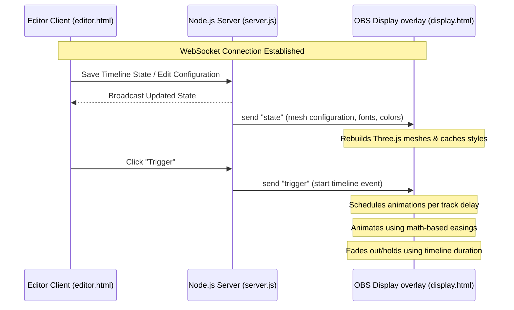
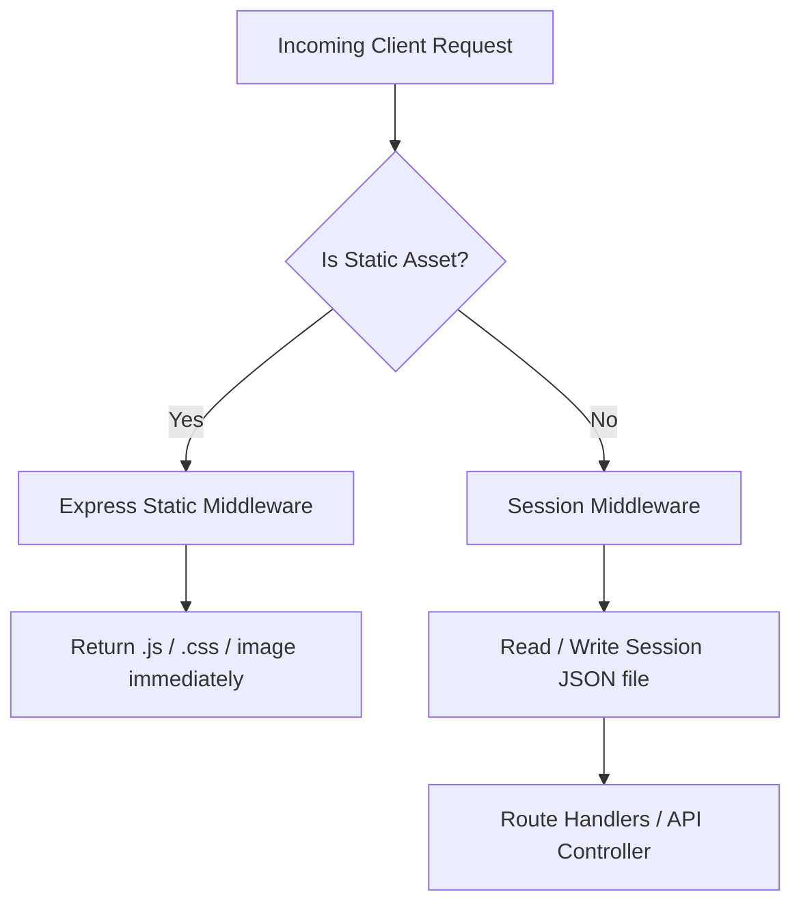

# 3D Title Editor & Overlay System

A professional, real-time 3D text animation system designed for OBS Browser Source overlays and video production. This repository contains the **3D Titles** editor and display module, alongside optimized integration for the sibling **VideoManager** system.

---

## 🎯 Goal

The main objectives of this system are:
1. **Real-time 3D Overlays**: Provide a high-performance, transparent 3D browser overlay for OBS that renders typography on a custom timeline.
2. **Synchronization**: Enable instant, frame-accurate synchronization of active text tracks, animation triggers, and scene states between the Editor control interface and the OBS Browser Source via WebSockets.
3. **Typography Flexibility**: Support automatic server-side font conversion (TTF/OTF to Three.js typeface JSON) to handle custom styles and non-English scripts like Malayalam.
4. **Platform Resilience**: Resolve critical Windows file-system locking conflicts (`EPERM`) occurring under concurrent static assets requests in the sibling `VideoManager` app.

---

## ⚙️ System Architecture & Workflow

The system is split into two active workflows: the **3D Titles Overlay Sync** and the **VideoManager Middleware Execution**.

### 1. 3D Titles WebSocket Synchronization Workflow



* **Timeline Editor**: The command-and-control dashboard (`editor.html` / `editor.js`) running at `http://localhost:5003/`. It manages active text tracks, styling parameters, animation presets, delays, and durations.
* **WebSocket Server**: The Express & WebSocket bridge (`server.js`) that persists timeline saves as JSON files and broadcasts state configurations (`init`, `state`), animation commands (`trigger`), and cleanup signals (`reset`) to all connected overlay clients.
* **OBS Display Overlay**: The output client (`display.html` / `display.js`) running at `http://localhost:5003/display`. It sets up a transparent 3D rendering context, caches geometry and fonts, processes inbound socket synchronization messages, and executes timeline animations.

---

### 2. VideoManager Session Persistence Workflow

To prevent database and session file-locking conflicts (`EPERM`) under high concurrent loading on Windows systems, the Express middleware stack runs in a streamlined sequence:



1. **Static Files First**: Public assets, JS bundles, and stylesheets are intercepted immediately by `express.static` before triggering session middleware, removing unnecessary read/write operations from static requests.
2. **Session Store Backoff**: When API routes are hit, the session-file-store employs an exponential retry backoff (up to `5` retries) to gracefully wait for files to be unlocked on Windows.

---

## 🛠️ Implementation Details

### 1. Transparent 3D Viewport (`Three.js`)
* **Renderer**: Initialized with `alpha: true` and cleared with `setClearColor(0x000000, 0)` to guarantee a transparent canvas suitable for OBS overlay keying.
* **Scene Lights**: A combination of a soft `AmbientLight` (to illuminate base colors) and a high-intensity `DirectionalLight` (to create depth, specular highlights, and outline bevels).
* **Camera Setup**: Utilizes an `OrthographicCamera` centered on the viewport to ensure title meshes do not suffer from perspective distortion when moving near screen edges.

### 2. Dynamic Text Shaping Engine (`opentype.js` GSUB)

For custom fonts (anything other than Helvetiker), text is shaped dynamically on the server each time it changes:

1. `POST /api/shape` receives the typed text and font ID.
2. `font.stringToGlyphs(text)` is called — this applies the font's **GSUB** (Glyph Substitution) OpenType tables, which replace character sequences with the correct conjunct and ligature glyphs. For Malayalam this means sequences like ഷ + ് + ണ → the pre-composed ഷ്ണ glyph.
3. Each shaped glyph's raw path commands are extracted in **Y-up font coordinates** (no axis flip), offset by the cursor position, and normalised to 1 em = 1 unit.
4. The client receives these commands and builds a `THREE.ShapePath`, calls `.toShapes(true)`, and feeds the result into `THREE.ExtrudeGeometry` — giving full 3D extrusion and bevels with correct ligature rendering.
5. Results are cached by `fontId + text` key so subsequent renders are instant.

### 3. Mathematical Easing Engines
All transition movements are written using pure, framerate-independent mathematical easing algorithms inside [display.js](file:///c:/KC_Assets/3DTitles/public/display.js):
* **Bounce (Crash Land / Drop)**: `easeOutBounce` models gravity acceleration and realistic ground rebounds:
  $$\text{easeOutBounce}(t) = \begin{cases} 7.5625 t^2 & t < \frac{1}{2.75} \\ 7.5625(t - \frac{1.5}{2.75})^2 + 0.75 & t < \frac{2}{2.75} \\ 7.5625(t - \frac{2.25}{2.75})^2 + 0.9375 & t < \frac{2.5}{2.75} \\ 7.5625(t - \frac{2.625}{2.75})^2 + 0.984375 & \text{otherwise} \end{cases}$$
* **Elastic (Zip In)**: `easeOutElastic` creates a spring-like dampening bounce at the destination:
  $$\text{easeOutElastic}(t) = 2^{-10t} \cdot \sin\left(\frac{t \cdot 10 - 0.75}{3} \cdot 2\pi\right) + 1$$
* **Anticipation (Back Ease)**: `easeOutBack` overshoots the target coordinate slightly and pulls back into place:
  $$\text{easeOutBack}(t) = 1 + 2.70158 \cdot (t - 1)^3 + 1.70158 \cdot (t - 1)^2$$

---

## 📦 Completed Modules

### 1. 3D Titles Module (`c:\KC_Assets\3DTitles`)
* **[server.js](file:///c:/KC_Assets/3DTitles/server.js)**: Integrates Express routes with a WebSocket server (`ws://localhost:5003/`). Express explicitly routes requests for `/` to `editor.html` and `/display` to `display.html`.
* **[editor.html](file:///c:/KC_Assets/3DTitles/public/editor.html)**: The timeline editor UI — houses the track controls, animation preset selectors, font picker, delay/duration inputs, and trigger/reset buttons.
* **[editor.js](file:///c:/KC_Assets/3DTitles/public/editor.js)**: Client-side logic for the editor — manages track state, communicates with the server over WebSocket, and handles open/save/save-as file operations.
* **[editor.css](file:///c:/KC_Assets/3DTitles/public/editor.css)**: Stylesheet for the editor dashboard — layout, dark-mode theme, timeline track UI, and button styling.
* **[display.html](file:///c:/KC_Assets/3DTitles/public/display.html)**: Embeds the transparent canvas and loads Three.js core along with standard font and text geometry modules.
* **[display.js](file:///c:/KC_Assets/3DTitles/public/display.js)**: Houses the animation engine, Three.js runtime loop, math-based easing routines, track lifecycle management, and WebSocket reconnect loops.

### 2. VideoManager Module (`C:\KC_Assets\VideoManager`)
* **[index.ts](file:///C:/KC_Assets/VideoManager/server/src/index.ts)**: Configures the Express middleware sequence to serve static resources before checking session store values, and elevates `session-file-store` `retries` to `5` to resolve Windows `EPERM` file exceptions.

---

## 🚀 Quick Start

### 1. Boot up 3D Titles

Ensure you have Node.js installed, then execute:
```bash
cd "C:\KC_Assets\3DTitles"
npm install
node server.js
```

### 2. View in Browser

* **Editor Dashboard**: [http://localhost:5003/](http://localhost:5003/)
* **OBS Browser Source**: [http://localhost:5003/display](http://localhost:5003/display)

---

## 🎭 Animation Presets Reference

| Preset | Mathematics / Easing | Behavior |
| :--- | :--- | :--- |
| **Crash Land (Top)** | `easeOutBounce` | Falls vertically from above the screen and bounces at the origin. |
| **Zip In (Right)** | `easeOutElastic` | Slides quickly from the right margin, spring-bouncing to a halt. |
| **Zip In + Spin** | `easeOutElastic` + Rotation | Slides from the right with elastic dampening, then begins spinning continuously on its Y-axis. |
| **Spin Continuously** | Constant delta-time step | Fades in and spins forever on its Y-axis. |
| **Spin & Stop** | `easeOutQuad` | Spins rapidly on entrance, decelerating smoothly to a stable facing angle. |
| **Bounce** | Periodic Sine absolute wave | Drops in and performs a gentle, loopable vertical bouncing motion. |
| **Fade In** | Linear Interpolation | Transitions opacity from transparent to solid with no spatial motion. |
| **Static** | Step function | Appears instantly at the destination coordinates with no transition. |

---

## 🎨 Stacking Timeline Tracks Example

You can set sequential delays (in milliseconds) on individual text layers to build a cascading overlay sequence:

| Track | Text Content | Animation Preset | Start Delay | Duration Hold |
| :--- | :--- | :--- | :--- | :--- |
| **1** | `BREAKING NEWS` | Crash Land (Top) | `0 ms` | `5000 ms` |
| **2** | `Special Announcement` | Zip In (Right) | `800 ms` | `4200 ms` |
| **3** | `Live from Studio A` | Zip In + Spin | `1600 ms` | `3400 ms` |

Click **▶ Trigger** in the Editor to fire this timeline sequence simultaneously across all connected overlays.

---

## 🔠 Malayalam & Custom Fonts Setup

Three.js TextGeometry uses the typeface JSON format. The server converts your standard font files automatically.

### Steps:
1. Download a font of your choice (e.g., [Noto Serif Malayalam](https://fonts.google.com/noto/specimen/Noto+Serif+Malayalam)) in `.ttf` or `.otf` format.
2. Place the file inside the `fonts/` folder (`C:\KC_Assets\3DTitles\fonts`).
3. Open or refresh the Editor (`http://localhost:5003/`). The server automatically converts any `.ttf`/`.otf` files to the Three.js typeface JSON format on each `/api/fonts` request, so the new font will appear in the dropdown immediately.
4. If you add a font while the editor is already open, click **↻ Fonts** to rescan and refresh the list.
5. Select the converted font in the font selector dropdown for any track.

> [!WARNING]
> **Malayalam Complex Script Limitations**
> Native Three.js `TextGeometry` draws characters sequentially and **does not handle complex script shaping** (such as Malayalam conjunct forms, ligatures, or vowel sign positioning). If you need complex shapes, arrange strings carefully without complex conjuncts (e.g., using simpler code points), or use pre-rendered graphic templates.

---

## 📺 OBS Studio Setup

1. Add a new **Browser Source** to your active Scene.
2. Set the URL to: `http://localhost:5003/display`
3. Set Width to `1920` and Height to `1080` (or match your stream canvas size).
4. Check **"Shutdown source when not visible"** (restarts WebSocket connection on scene change).
5. Leave the background transparent. The output canvas overlays perfectly above your underlying video feeds.
